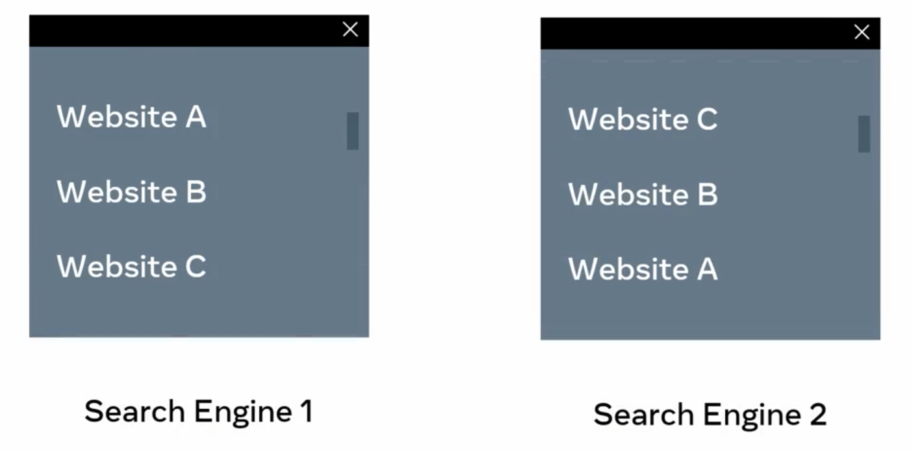

Los motores de busqueda analizan las paginas web, mediante el uso correcto de las metaetiquetas, ya que estas brindan la informacion necesaria del sitio a los motores de busqueda.

Optimizacion de Motores de Busqueda

- SEO = Search Engine Optimization

Este proceso consiste en introducir mejoras enlas semantica y la entrega de contenidos de un sitio web, y su clasificacion, todo esto para mejorar:

- content → contenido
- semantics → semantica
- delivey → clasificacion

Cuando un motor de busqueda visita nuestro sitio web, analiza:

- html document → docuemento html
- medica content → contenido multimedia

Y si encuentra un enlace a otro documento, tambien sigue ese enlace para analizarlo y asi consecutivamente hasta analizar cada uno de los enlaces que tenga el sitio web, para analizar todo su contenido.

De a los resultados del analisis y el contenido del sitio web, el motor de busqueda clasificara el sitio web para varios terminos de busqueda.

Si bien el sitio web puede ser el resultado numero uno para un termino de busqueda, puede tener una posicion muy baja para otro. Ya que cada motor de busqueda tiene su propio algoritmo para clasificar los sitios web.

Ejemplo de clasificacion de dos motores de busqueda diferentes.



Aunque no se sabe como se determinan las clasificaciones, hay muchas practicas recomendadas que pueden seguir para influir en la forma en que los motores de busqueda analizan y clasifican su sitio web. Usando las metaetiquetas adecuadas

Como las metaetiquetas influyen en la clasificacion de los sitios web:

- Las metaetiquetas definen metadatos acerca de una pagina web
- Los metadatos, son datos sobre otros datos, son datos sobre la pagina web

Las metaetiquetas se añaden dentro del elemento de encabezado (**head)**de su documento html, y todo lo que coloquemos dentro de la etiqueta **head**, sera visible en el navegador, a menos que inspeccionemos el sitio con la herramienta para desarrolladores.

Es decir que las metaetiquetas son elementos que no se ven en el nageador, hay que tener en cuenta que:

- no tienen etiquetas de cierre
- un elemento meta tiene dos atributos
  - nombre y contenido (name especifica el nombre de los metadatos y content especifica el valor de los metadatos)

Ejemplo:

**Author Metadata**

- El metadato autor especifica el autor de la pagina web
- El atributo de contenido es la persona

```html
<meta name="author" content="Jane Wilson" />
```

```html
<! DOCTYPE html>
<html>
  <head>
    <meta name="author" content="Jane Wilson" />
  </head>
  <body></body>
</html>
```

a
