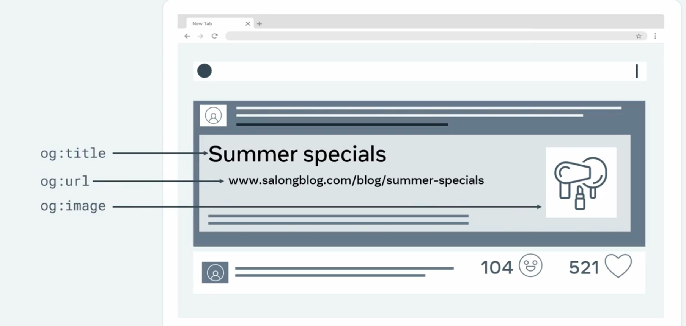

Estas metaetiquetas se utilizaran si planeamos compartir el sitio web en redes sociales

Al utilizar las metaetiquetas del Open Graph Protocol, generan una vista previa del enlace para permitir a los usuarios, saber de que se tratan las paginas web vinculadas, lo cual es util por que al compartir o recibir un enlace de un sitio web en alguna red social, nos brinda una vista previa del sitio antes de hacer clic en el enlace, lo cual hacerlo de la manera correcta significa mas clics y visitas al sitio web.

Estas etiquetas son diferentes a las del SEO tradicional, ya que esas estan orientadas hacia los resultados de busqueda no hacia enlaces directos

Anteriormente se ha visto que las metaetiqeutas estan definidas dentro del elemento de **head,** y en este caso las etiquetas del Open Graph Protocol tambien utiliza metaetiquetas agregadas al elemento **head.**

- La diferencia es que para el seo se utilizan **name** y para el og: se utilizan property (propiedad)

Ejemplo Metaetiqueta para SEO (posicionamiento en los motores de busqueda)

```html
<meta name="autor" content="Soluciones Digitales del Norte" />
```

Ejemplo de Metaetiqueta para Open Graph Protocol

```html
<meta property="og:tittle" content="Mi primera pagina web" />
```

Ambas llevan content (para definir el valor de la etiqueta)

Solo que cada propiedad del Open Graph Protocol, comienza con og, como convencion para identificarla como etiqueta relacinada con el Open Graph Protocol.

El Open Graph Protocol establece que se incluyan siempre 4 propiedades en una pagina web, las cuales son las siguientes:

1. og: tittle → titulo que se mostrara en la vista previa
2. og:type → define el tipo de contenido (como sitio web, video, musica o articulo)
   1. dependiendo del valor establecido en el tipo, algunas otras propiedades pueden ser obligatorias
3. og:url → define la direccion web permanente que la red social debe utilizar para la pagina especifica
4. og:image → definide una direccion url para una imagen que debe mostrar cuando se comprarte el sitio web

```html
<!-- Open Graph Protocol -->
<meta
  property="og:title"
  content="Plantilla Base Para la Creacion de un Sitio Web"
/>
<meta property="og:type" content="website" />
<meta property="og:url" content="https://example.com" />
<meta property="og:image" content="agregar-mi-imagen.jpg" />
```

Juntas, estas propiedades del Open Graph Protocol, permiten a las plataformas de redes sociales crear una vista previa del enlace web compartido.

Ejemplo de como se mostrara la tarjeta de vista previa al compartir el sitio en redes sociales.

!image.png
![alt text]

Existen otras propiedades opcionales como:

Description porperty

- proporciona una descripcion de la pagina web
- este texto se mostrara a los usuarios de que trata la pagina web

```html
<meta
  property="og:description"
  content="Agregar una breve descripcion del sitio web para mejorar el SEO y atraer a los visitantes"
/>
```

Locale property

- describe el idioma regional del sitio web
  - especifica que la pagina esta en español

```html
<meta property="og:locale" content="es_ES" />
```

Name property

- describe el nombre del sitio web al que pertenece la pagina
- Algunas plataformas de redes sociales tambien mostraran el nombre del sitio web junto al titulo de la pagina.

```html
<meta property="og:site_name" content="Mateo Website" />
```
